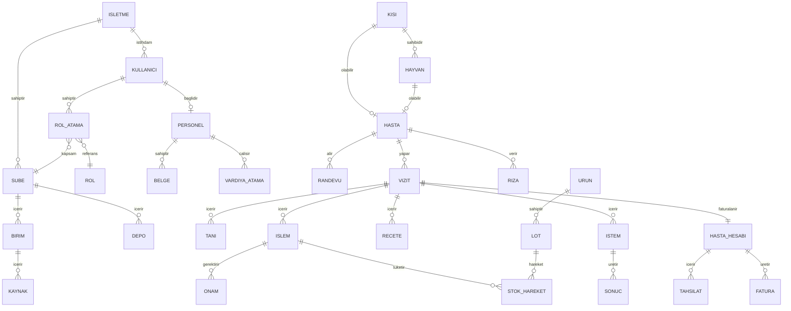

# 07 — Veri Modeli (Kavramsal)

Bu bölüm ana varlıkları ve ilişkileri tanımlar; fiziksel tablo tasarımı geliştirme aşamasında yapılacaktır. İç klinik veri modeli, ileride birlikte çalışabilirlik için **HL7 FHIR R4** kaynaklarıyla eşlenebilir şekilde kurgulanır (Patient, Encounter, Condition, Observation, MedicationRequest, Procedure, Consent, Practitioner, Organization, Location, Device…).

## 1. Çekirdek Varlıklar

## 2. Varlık Grupları

### 2.1. Organizasyon
- **İşletme (Tenant):** vergi no, unvan, abonelik, kurum tipleri.
- **Şube:** ruhsat no, ruhsat tarihi, kurum kodu (Bakanlık), mesul müdür, adres, çalışma saatleri, SGK anlaşma durumu.
- **Birim**, **Kaynak** (oda, ünit, cihaz, kafes, araç), **Depo/Lokasyon**.

### 2.2. Kimlik ve Yetki
- **Kullanıcı**, **Rol**, **İzin**, **RolAtama** (kullanıcı–rol–kapsam–geçerlilik), **ErişimPolitikası** (ABAC kuralları), **AcilErişimKaydı**, **OnayAkışı** / **OnayTalebi**.

### 2.3. Kişi / Hasta
- **Kişi** (ortak kimlik: hasta, hasta yakını, hayvan sahibi, personel aynı kişi olabilir), **Hasta** (klinik bağlam), **Hayvan**, **Sahiplik**, **Temsil** (veli/vasi), **Güvence** (SGK/özel sigorta/kurum), **UyarıBayrağı**, **Alerji**, **KronikHastalık**.
- **Rıza** (tür, metin sürümü, kanal, tarih, geri çekme), **AydınlatmaKaydı**.

### 2.4. Klinik
- **Randevu**, **Vizit/Başvuru (Encounter)**, **Tanı**, **Vital/Gözlem**, **Muayene Notu** (şablonlu yapılandırılmış JSON + serbest metin), **İstem**, **Numune**, **Sonuç**, **Görüntü** (DICOM referansı), **İşlem**, **Reçete** + **ReçeteKalemi**, **Rapor**, **Onam** (şablon sürümü + imza kanıtı), **İlaçUygulama**, **Konsültasyon**, **Sevk**, **TedaviPlanı** + **Seans**, **DişDurumu** (diş/yüzey/durum/katman), **EstetikUygulama** (bölge haritası, ürün/lot, parametre), **Aşı**, **YatışKaydı** (veteriner/günübirlik), **EvZiyareti** (GPS, zaman, imza), **Belge/Ek**.
- **Tüm klinik kayıtlar:** `olusturan`, `olusturma_zamani`, `imzalayan`, `imza_zamani`, `surum`, `onceki_surum_id`, `gizlilik_seviyesi` (normal / kısıtlı / çok gizli).

### 2.5. Personel
- **Personel**, **Sözleşme**, **Belge** (tür, no, başlangıç, bitiş, dosya, doğrulama durumu), **Yetkinlik/Sertifika**, **VardiyaŞablonu**, **NöbetPlanı**, **VardiyaAtama**, **TakasTalebi**, **Puantaj**, **İzin**, **Hakediş Modeli**, **HakedişDönemi**, **Eğitim** + **Katılım**, **Zimmet**, **PerformansDeğerlendirme**.

### 2.6. Stok ve Cihaz
- **Ürün**, **Lot**, **StokLokasyonu**, **StokHareketi** (giriş, çıkış, transfer, sayım, fire, iade — kaynak belge referanslı), **SatınAlmaTalebi**, **Sipariş**, **MalKabul**, **Tedarikçi**, **SıcaklıkÖlçümü**, **NarkotikHareket**, **ResmîBildirim** (İTS/ÜTS kuyruk kaydı).
- **Cihaz**, **BakımPlanı**, **BakımKaydı**, **Kalibrasyon**, **Arıza**, **SterilizasyonSeti**, **SterilizasyonÇevrimi**, **İndikatörSonucu**.

### 2.7. Finans
- **Hizmet**, **FiyatListesi** + **FiyatKalemi** (sürümlü), **HastaHesabı**, **HesapKalemi**, **İndirim**, **Tahsilat**, **ÖdemePlanı** + **Taksit**, **Fatura**, **İade**, **Kasa**, **KasaHareketi**, **GünSonu**, **Gider**, **Cari** (kurum/sigorta/tedarikçi/lab), **Provizyon**, **SGKFaturaDönemi**, **Kesinti**, **Paket** + **PaketBakiyesi**.

### 2.8. Kalite, Uyum, İletişim
- **Olay**, **DÖF**, **Şikâyet**, **Denetim** + **Bulgu**, **KaliteGöstergesi** + **Ölçüm**, **Doküman** + **Sürüm** + **OkumaOnayı**, **Komite** + **Toplantı** + **Karar**, **AtıkKaydı**, **DozimetreÖlçümü**, **İSGKaydı**.
- **KVKKBaşvurusu**, **İhlalKaydı**, **İmhaListesi**, **VeriEnvanteri**.
- **MesajŞablonu**, **Mesaj** (gönderim logu), **Kampanya**, **Anket** + **Yanıt**, **Lead**.
- **Alarm Kuralı**, **Alarm**, **Görev**, **Bildirim**.

### 2.9. Denetim İzi
- **AuditLog** (append-only): zaman, kullanıcı, rol sıfatı, eylem (okuma/yazma/silme girişimi/dışa aktarma/yazdırma), varlık tipi + id, hasta id, IP, cihaz, gerekçe, önceki kaydın hash’i.

## 3. Önemli Modelleme Kararları
1. **Kişi–Hasta ayrımı:** Personel aynı kurumda hasta olabilir; aynı “Kişi” kaydı, iki farklı bağlam. Personel-hasta kayıtları otomatik “Kısıtlı” olur.
2. **Veteriner uyumu:** “Hasta” soyut bir kavramdır; bir Kişi’ye veya bir Hayvan’a bağlanır. Böylece randevu, vizit, fatura modülleri iki dünyada aynı kalır; fatura her zaman bir Kişi/Kurum’a kesilir.
3. **Silme yok:** Klinik ve finansal kayıtlar mantıksal olarak iptal edilir (`iptal_nedeni`, `iptal_eden`); KVKK imhası ayrı ve kontrollü bir süreçtir.
4. **Sürümlü referans veriler:** Fiyat listeleri, onam şablonları, SUT kodları, ICD sürümü, mevzuat parametreleri geçerlilik tarihli tutulur.
5. **Çok kiracılı (multi-tenant) izolasyon:** Her kayıtta `isletme_id`; veritabanı seviyesinde satır güvenliği (Row Level Security).
6. **Gizlilik seviyesi alanı** her klinik kayıtta vardır ve sorgu katmanında zorunlu filtre olarak uygulanır.
